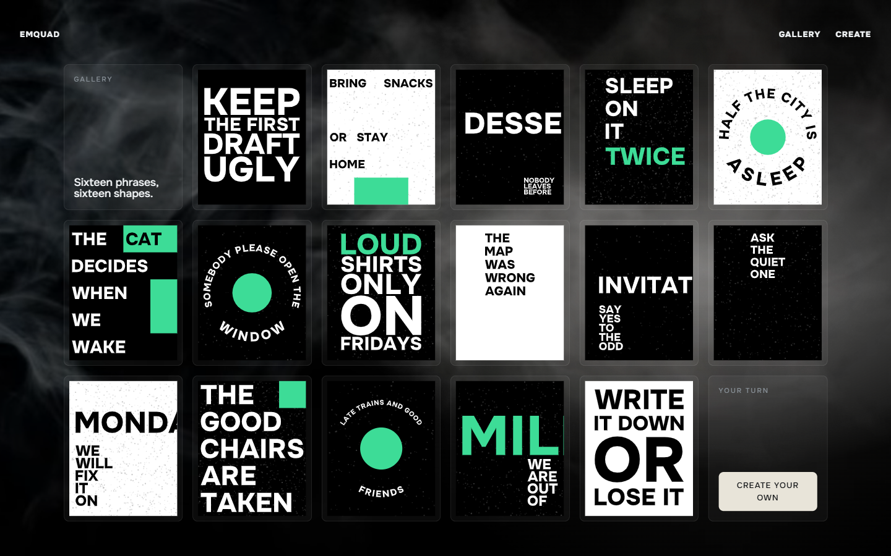
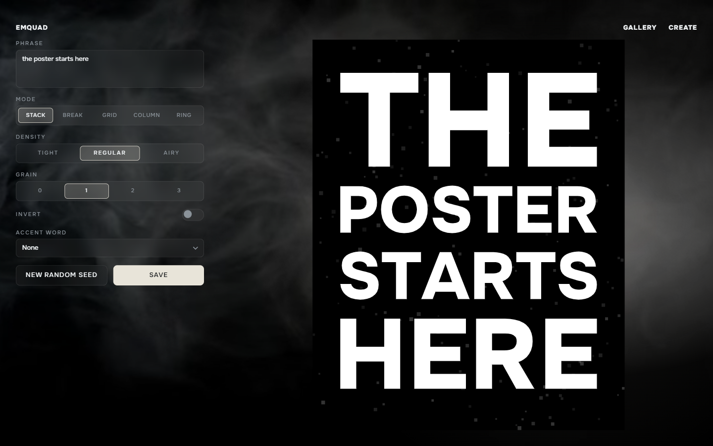

# Emquad

A typographic poster generator — type a short phrase, get a poster, a permanent link and a file.

Emquad is a personal project built as a case study in one idea: a poster is not
a template with your text dropped into it. The phrase itself decides the
layout. Three to seven words go in, and the composition is computed from their
letters.

**Live:** [emquad.vercel.app](https://emquad.vercel.app)



## Stack

Next.js 16 (App Router) · TypeScript (strict) · Tailwind CSS v4 · Neon Postgres · Drizzle ORM · Turbopack

No canvas library, no SVG library, no font loader. The renderer is one module
of plain TypeScript that returns a string — see [Architecture](#architecture)
for why that constraint is the whole project.

## Features

**Editor**

- Five composition modes — stack, break, grid, column, ring
- Density, grain level, inversion, an accent word and a random seed
- Live preview with zero network requests: every parameter change is rendered locally
- Validation with specific messages rather than a disabled button
- All parameters encoded in the URL, so any composition is a shareable link

**Posters**

- Permanent addresses: a saved poster keeps its link and its exact appearance
- PNG and SVG download with correct UTF-8 filenames
- A generated Open Graph image per poster, composed by the same renderer
- Canonical tags, JSON-LD and a sitemap that includes every gallery poster

**Gallery**

- Sixteen accepted posters, ordered as a wall rather than by date

**Throughout**

- Rendered on the server, hydrated once, no layout shift on load
- Responsive from 320px up
- Self-hosted typeface, no requests to third-party CDNs



## Architecture

**One pure function renders every poster.** `lib/poster/render.ts` takes a
specification and returns an SVG string. No browser APIs, no React, no Node
APIs, no dependencies. Six consumers call it: the editor preview, the poster
page, the PNG and SVG download routes, the Open Graph image route and the
gallery wall. Because they all call the same function, a link saved a year ago
still renders byte for byte what it rendered then — which is the promise the
product makes on its first screen.

**The poster forbids everything the OG renderer cannot draw.** No SVG filters,
no blur, no shadows, no gradients, no masks, no `foreignObject`, no external
fonts. The Open Graph rasteriser supports none of them, and a poster that looks
different in a link preview than on the page would break the same promise.
Grain is therefore drawn as geometry — thousands of small rectangles placed
from a seeded generator — rather than as a filter. Atmosphere lives on the
pages around the poster, never inside it.

**Type is outlines, not text.** Glyphs are extracted from Onest into contour
data and emitted as `path` elements. A rendered poster contains zero `text`
elements and depends on no font being installed or loaded anywhere. This is
what makes the download, the preview and the link card identical.

**Five modes that must not converge.** Each mode owns its layout policy —
margins, type size, line breaking, every composition constant — and those stay
private to it. The acceptance criterion is deliberately visual: blurred down to
blobs, the five must still read as five different silhouettes. Only font
metrics are shared, because font data is not policy.

**Hashes make a regression impossible to miss.** `npm run lab` renders every
case and writes a hash per output. A change that alters the result of an
existing specification shows up as a changed hash and is treated as a
regression, not an improvement — permanence is a feature, so "it looks better
now" is not an argument. The same run applies geometric checks: margins, bleed,
row structure, type-size ratios between density settings, and per-mode
invariants.

**The URL is the editor's state.** Parameters are parsed from and serialised to
query parameters, validated against known values, with anything unrecognised
dropped rather than thrown. A hand-edited URL degrades to defaults. The
practical upside is that the preview needs no server: the editor renders the
same function the server would.

**Saving is defended.** Writes go through a Server Action with a rate limit per
client and a deduplication window, so repeatedly pressing Save on the same
composition returns the existing poster instead of filling the table with
identical rows.

## Project structure

```text
app/          routes, metadata, robots and sitemap
components/   editor, gallery wall, poster display, global chrome
lib/poster/   the renderer: render.ts, five modes, primitives, glyph data
lib/db/       schema and queries
lib/seo/      JSON-LD builders
lab/          composition cases and geometric checks
seed/         gallery data and sync scripts
```

## Running locally

Requires Node 20.9+ and a Postgres connection string in `.env.local`:

```ini
DATABASE_URL=postgres://...
```

```bash
npm install
npm run db:migrate
npm run dev
```

The dev server runs on port 3100.

Other scripts:

```bash
npm run build            # production build
npm run lint
npm run lab              # render every case and run the geometry checks
npm run gallery:check    # validate the gallery address set
npm run db:generate      # generate a Drizzle migration
```

## Deployment

Deployed to Vercel on every push to `main`. Poster pages, the gallery and the
sitemap are server-rendered on demand because they read from the database; the
home page and `robots.txt` are static.

## Typeface and media

Set in [Onest](https://github.com/simpals/onest), self-hosted in two weights
and used under the SIL Open Font License 1.1. The background video is from
Pexels and used under the Pexels License.

---

Built by [Ivan Shevchenko](https://github.com/shevdevworks) — [shevdevworks.github.io/portfolio](https://shevdevworks.github.io/portfolio)
